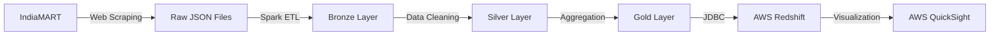

# 🚀 IndiaMART ETL Data Pipeline

[](https://python.org)
[](https://airflow.apache.org/)
[](https://spark.apache.org/)
[](https://aws.amazon.com/redshift/)

A comprehensive data engineering solution that scrapes product data from IndiaMART, processes it through a modern Medallion Architecture, and delivers actionable insights through cloud-based analytics.

## 📋 Table of Contents

- [Overview](#overview)
- [Architecture](#architecture)
- [Technology Stack](#technology-stack)
- [Project Structure](#project-structure)
- [Prerequisites](#prerequisites)
- [Installation & Setup](#installation--setup)
- [Configuration](#configuration)
- [Running the Pipeline](#running-the-pipeline)
- [Data Flow](#data-flow)
- [Monitoring](#monitoring)
- [Troubleshooting](#troubleshooting)
- [Contributing](#contributing)
- [License](#license)

## 🎯 Overview

This ETL pipeline solves the challenge of extracting valuable business intelligence from IndiaMART's vast product catalog. The solution:

- **Extracts** product data from multiple IndiaMART categories using intelligent web scraping
- **Transforms** raw data through a three-tier Medallion Architecture (Bronze → Silver → Gold)
- **Loads** curated datasets into AWS Redshift Serverless for high-performance analytics
- **Visualizes** insights through AWS QuickSight dashboards
- **Orchestrates** the entire workflow using Apache Airflow with automated scheduling

### Key Features

✅ **Scalable Web Scraping**: Multi-threaded scraping with rate limiting and error handling  
✅ **Medallion Data Architecture**: Industry-standard bronze/silver/gold data layering  
✅ **Cloud-Native Storage**: AWS Redshift Serverless for cost-effective data warehousing  
✅ **Automated Orchestration**: Airflow DAGs with dependency management and monitoring  
✅ **Data Quality**: Built-in deduplication, validation, and transformation logic  
✅ **Analytics Ready**: Pre-structured data optimized for business intelligence  

## 🏗️ Architecture


### Data Flow



### Analytics Dashboard


## 🛠️ Technology Stack

| Component | Technology | Version | Purpose |
|-----------|------------|---------|---------|
| **Orchestration** | Apache Airflow | 2.10.2 | Workflow management and scheduling |
| **Data Processing** | Apache Spark | 3.4.3 | Large-scale data processing and ETL |
| **Web Scraping** | Scrapy + BeautifulSoup | 2.11.2 | Data extraction from IndiaMART |
| **Data Warehouse** | AWS Redshift Serverless | - | Cloud data warehouse |
| **Visualization** | AWS QuickSight | - | Business intelligence dashboards |
| **Runtime** | Python | 3.11.9 | Core programming language |
| **Storage** | Parquet + JSON | - | Efficient data storage formats |

## 📁 Project Structure

```
ETL-pipeline/
├── 📂 dags/                     # Airflow DAG definitions
│   ├── datacategories.py       # Category scraping DAG
│   ├── product-scrap-dag.py    # Product scraping DAG
│   └── medallion-dags.py       # Data processing DAG
├── 📂 medallion-scripts/       # Spark processing scripts
│   ├── bronze.py              # Raw data ingestion
│   ├── silver.py              # Data cleaning & transformation
│   └── gold.py                # Data aggregation & loading
├── 📂 scraper_v1/             # Scrapy project
│   └── scraper_v1/            # Scrapy spiders and settings
├── 📂 scraped_content/        # Raw scraped data storage
├── 📂 redshiftjdbcdriver/     # Redshift JDBC drivers
├── 🐍 product_scraper.py      # Standalone scraping script
├── 📋 requirements.txt        # Python dependencies
└── 📖 README.md              # This file
```

## ⚡ Prerequisites

### System Requirements
- **Python**: 3.11.9 or higher
- **Memory**: Minimum 8GB RAM (16GB recommended for Spark jobs)
- **Storage**: 10GB free space for data processing
- **OS**: Linux, macOS, or Windows with WSL2

### External Services
- **AWS Account** with IAM permissions for:
  - Redshift Serverless
  - QuickSight (optional for visualization)
- **IndiaMART access** (public website - no authentication required)

### Required Tools
- `pyenv` (for Python version management)
- `git` (for version control)
- Java 8+ (for Spark)

## 🚀 Installation & Setup

### 1. Clone Repository
```bash
git clone https://github.com/adhithyasimha/ETL-pipeline.git
cd ETL-pipeline
```

### 2. Python Environment Setup
```bash
# Install Python 3.11.9 using pyenv
pyenv install 3.11.9
pyenv virtualenv 3.11.9 etl-pipeline-env
pyenv activate etl-pipeline-env

# Verify Python version
python --version  # Should show Python 3.11.9
```

### 3. Install Dependencies
```bash
pip install --upgrade pip
pip install -r requirements.txt
```

### 4. Verify Installations
```bash
# Check Airflow installation
airflow version

# Check Spark installation
python -c "import pyspark; print(pyspark.__version__)"

# Check Scrapy installation
scrapy version
```

## ⚙️ Configuration

### 1. Environment Variables
Create a `.env` file in the project root:

```bash
# AWS Configuration
AWS_REGION=your-aws-region
REDSHIFT_HOST=your-redshift-cluster.region.redshift-serverless.amazonaws.com
REDSHIFT_PORT=5439
REDSHIFT_DB=dev
REDSHIFT_USER=admin
REDSHIFT_PASSWORD=your-secure-password

# Project Paths (adjust to your setup)
PROJECT_ROOT=/path/to/your/ETL-pipeline
AIRFLOW_HOME=/path/to/your/airflow
MEDALLION_DATA_PATH=/path/to/medallion/data
SCRAPED_DATA_PATH=/path/to/scraped/content

# Scraping Configuration
SCRAPING_DELAY=1
MAX_CONCURRENT_REQUESTS=8
```

### 2. Update Configuration Files

**Update DAG file paths** in the following files to match your environment:
- `dags/datacategories.py`
- `dags/product-scrap-dag.py`
- `dags/medallion-dags.py`

**Update Spark script paths** in:
- `medallion-scripts/bronze.py`
- `medallion-scripts/silver.py`
- `medallion-scripts/gold.py`

### 3. AWS Setup
```bash
# Configure AWS credentials (choose one method)

# Method 1: AWS CLI
aws configure
# Enter your Access Key ID, Secret Access Key, and region

# Method 2: Environment variables
export AWS_ACCESS_KEY_ID=your-access-key
export AWS_SECRET_ACCESS_KEY=your-secret-key
export AWS_DEFAULT_REGION=your-region

# Method 3: IAM role (if running on EC2)
# No configuration needed if using IAM roles
```

### 4. Create Required Directories
```bash
mkdir -p {scraped_content,medallion/{bronze,silver,gold}}
```

## Architecture


### Analytics

Storage: Gold layer data is loaded into AWS ```Redshift Serverless``` for scalable querying.
Visualisation: Dashboards are built in AWS QuickSight to provide insights into:


## 🏃‍♂️ Running the Pipeline

### 1. Initialize Airflow
```bash
# Initialize Airflow database
airflow db init

# Create an admin user
airflow users create \
    --username admin \
    --firstname Admin \
    --lastname User \
    --role Admin \
    --email admin@example.com

# Start Airflow in development mode
airflow standalone
```

### 2. Deploy DAGs
```bash
# Copy DAGs to Airflow directory
cp dags/*.py $AIRFLOW_HOME/dags/

# Verify DAGs are loaded
airflow dags list | grep -E "(indiamart|product|medallion)"
```

### 3. Manual Execution (for testing)
```bash
# Test individual DAGs
airflow dags test indiamart_category_dag 2025-01-01
airflow dags test product_scrapping_dag 2025-01-01
airflow dags test medallion_dags 2025-01-01

# Or run the standalone scraper
python product_scraper.py
```

### 4. Automated Scheduling
The pipeline runs automatically with the following schedule:

| DAG | Schedule | Purpose |
|-----|----------|---------|
| `indiamart_category_dag` | Daily at 00:00 | Scrape category links |
| `product_scrapping_dag` | Daily at 00:05 | Scrape product details |
| `medallion_dags` | Daily at 00:10 | Process through Bronze→Silver→Gold |

## 🔄 Data Flow

### Stage 1: Data Extraction
```bash
# Categories are scraped first
IndiaMART Categories → categories.json

# Products are then scraped from each category
Category URLs → indiamart_products.json
```

### Stage 2: Medallion Architecture Processing

#### Bronze Layer (Raw Data Ingestion)
```python
# File: medallion-scripts/bronze.py
- Reads raw JSON files
- Stores as Parquet with date partitioning
- No transformations applied
- Location: medallion/bronze/date=YYYY-MM-DD/
```

#### Silver Layer (Data Cleaning & Transformation)
```python
# File: medallion-scripts/silver.py
- Cleans price data (removes ₹, /Piece)
- Converts data types (Price → double, Rating → double)
- Deduplicates records
- Partitions by category
- Location: medallion/silver/{category_name}/
```

#### Gold Layer (Analytics & Loading)
```python
# File: medallion-scripts/gold.py
- Aggregates data for analytics
- Loads into Redshift tables by category
- Optimized for query performance
- Ready for visualization
```

### Stage 3: Analytics & Visualization
```bash
AWS Redshift Tables → AWS QuickSight Dashboards
```

## 📊 Expected Outputs

### Sample Data Structure

**Bronze Layer (Raw)**:
```json
{
  "Product Name": "Industrial Equipment XYZ",
  "Price": "₹1,50,000/Piece",
  "Rating": "4.5",
  "Supplier": "ABC Industries",
  "Location": "Mumbai, Maharashtra",
  "Category": "industrial-equipment"
}
```

**Silver Layer (Cleaned)**:
```json
{
  "Product Name": "Industrial Equipment XYZ",
  "Price": 150000.0,
  "Rating": 4.5,
  "Supplier": "ABC Industries", 
  "Location": "Mumbai, Maharashtra",
  "Category": "industrial-equipment"
}
```

**Gold Layer (Redshift Tables)**:
- `industrial_equipment`
- `electronics` 
- `textiles`
- etc. (one table per category)

## 📈 Monitoring

### Airflow Web UI
- Access: `http://localhost:8080`
- Monitor DAG runs, task status, and logs
- Set up alerts for failed tasks

### Data Quality Checks
```bash
# Check record counts
python -c "
from pyspark.sql import SparkSession
spark = SparkSession.builder.getOrCreate()
df = spark.read.parquet('medallion/bronze/')
print(f'Bronze records: {df.count()}')
"
```

### Log Monitoring
- Airflow logs: `$AIRFLOW_HOME/logs/`
- Spark logs: Check Spark UI at `http://localhost:4040`
- Application logs: Check individual script outputs

## 🔧 Troubleshooting

### Common Issues

**🚨 Issue**: DAGs not appearing in Airflow UI
```bash
# Solution: Check DAG syntax and refresh
python -m py_compile dags/*.py
airflow dags list-import-errors
```

**🚨 Issue**: Spark out of memory errors
```bash
# Solution: Increase Spark memory in scripts
spark = SparkSession.builder \
    .config("spark.executor.memory", "4g") \
    .config("spark.driver.memory", "2g") \
    .getOrCreate()
```

**🚨 Issue**: Redshift connection failures
```bash
# Solution: Check credentials and network access
python -c "
import psycopg2
conn = psycopg2.connect(
    host='your-redshift-host',
    port=5439,
    database='dev',
    user='admin',
    password='your-password'
)
print('Connection successful!')
"
```

**🚨 Issue**: Web scraping blocked/rate limited
```bash
# Solution: Adjust delays in scraper settings
# Edit scraper_v1/scraper_v1/settings.py
DOWNLOAD_DELAY = 3
RANDOMIZE_DOWNLOAD_DELAY = 0.5 * DOWNLOAD_DELAY
```

### Performance Optimization

1. **Increase Spark parallelism**:
   ```python
   spark.conf.set("spark.sql.adaptive.enabled", "true")
   spark.conf.set("spark.sql.adaptive.coalescePartitions.enabled", "true")
   ```

2. **Optimize Redshift loading**:
   ```python
   df.write.jdbc(
       url=redshift_url,
       table=table_name,
       mode="append",
       properties={
           "batchsize": "10000",
           "driver": "com.amazon.redshift.jdbc.Driver"
       }
   )
   ```

3. **Tune scraping performance**:
   ```python
   # In settings.py
   CONCURRENT_REQUESTS = 16
   CONCURRENT_REQUESTS_PER_DOMAIN = 8
   ```

## 🤝 Contributing

We welcome contributions! Please follow these guidelines:

### Development Setup
```bash
# Fork the repository
git clone https://github.com/your-username/ETL-pipeline.git
cd ETL-pipeline

# Create a feature branch
git checkout -b feature/your-feature-name

# Make your changes and test
python -m pytest tests/  # If tests exist

# Submit a pull request
```

### Code Standards
- Follow PEP 8 for Python code
- Add docstrings to functions and classes
- Include error handling and logging
- Test your changes locally before submitting

### Areas for Contribution
- 🔍 Add more data sources beyond IndiaMART
- 📊 Enhance data quality validation
- 🚀 Implement real-time streaming capabilities
- 📈 Add more sophisticated analytics
- 🛡️ Improve security and credential management
- 📝 Expand documentation and examples

## 📄 License

This project is licensed under the MIT License - see the [LICENSE](LICENSE) file for details.

## 🙏 Acknowledgments

- **IndiaMART** for providing accessible product data
- **Apache Software Foundation** for Airflow and Spark
- **AWS** for reliable cloud infrastructure
- **Scrapy Community** for excellent web scraping tools

---

**⭐ If this project helped you, please give it a star!**

For questions or support, please open an issue or contact the maintainers.
